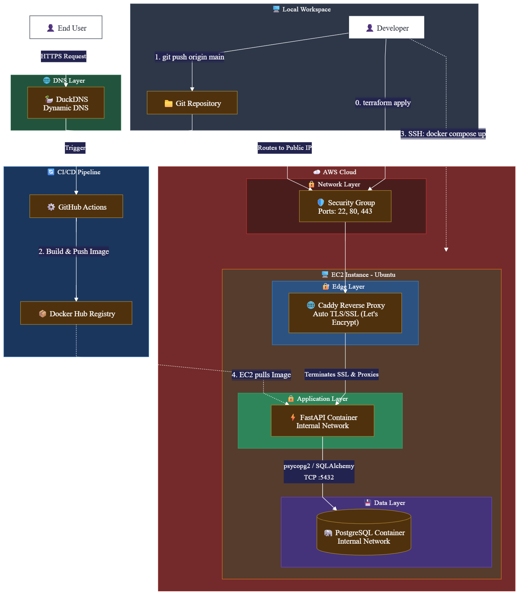
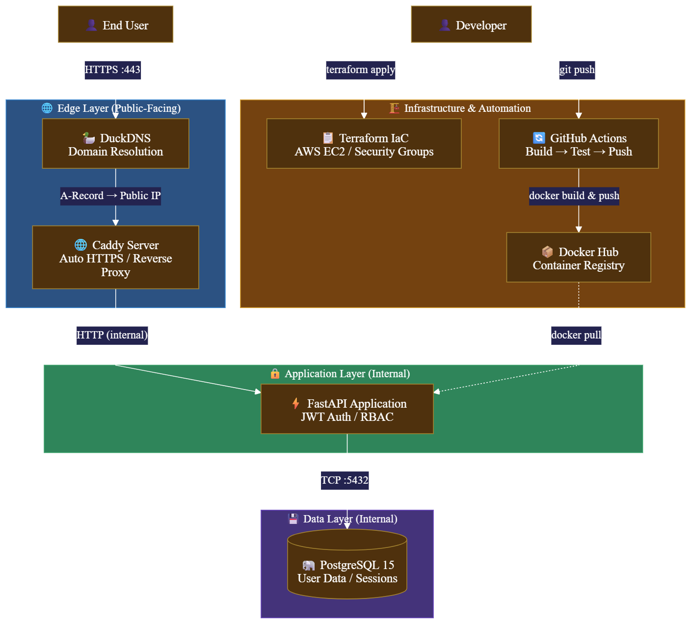

# 🔐 IAM-API-V2

> **Production-grade Identity & Access Management API** — containerized, secured with HTTPS, provisioned via Infrastructure as Code, and deployed with a fully automated CI/CD pipeline.

A stateless authentication and authorization service built with **FastAPI** and **PostgreSQL**, featuring **JWT-based authentication**, **bcrypt password hashing**, and **Role-Based Access Control (RBAC)**. Engineered for production from the ground up: containerized with Docker, automatically built via GitHub Actions, and deployed securely on an **AWS EC2** instance provisioned via **Terraform**, sitting behind a **Caddy Reverse Proxy** with automated TLS encryption.

---

## 🏷️ Tech Stack


---

## 🏗️ Architecture Overview

The system is designed around a clean, automated pipeline from local development to cloud production, entirely secured via automated SSL/TLS certificates and deployed via declarative infrastructure.

---


---

## ✨ Key Features

### ⚙️ DevOps & Infrastructure
*   **Infrastructure as Code (Terraform)** — The entire AWS environment (Compute, OS, Networking, Security Groups, SSH Keys) is defined declaratively in `main.tf`. The environment can be destroyed and perfectly recreated in under 60 seconds.
*   **Fully Containerized** — The API, PostgreSQL database, and Caddy proxy run as isolated Docker networks, ensuring environment parity and network security.
*   **Automated CI/CD Pipeline** — Every push to `main` triggers a GitHub Actions workflow that builds and publishes a fresh production image to Docker Hub — zero manual steps.

### 🔒 Security
*   **Production HTTPS / TLS Encryption** — All API traffic is securely routed through a Caddy reverse proxy that automatically manages Let\'s Encrypt SSL certificates. The FastAPI backend is completely hidden from the public internet.
*   **bcrypt Password Hashing** — User passwords are never stored in plaintext. All credentials are hashed using `bcrypt` before persistence.
*   **JWT Stateless Authentication** — Issues cryptographically signed JSON Web Tokens (SHA-256) upon successful login, enabling stateless, scalable session management.
*   **Role-Based Access Control (RBAC)** — Granular authorization middleware using FastAPI\'s `Depends` injection system, cleanly separating `user` and `admin` endpoint access.

### 👨‍💻 Developer Experience (DX)
*   **Branded Developer Portal** — Rich, categorized interactive API documentation powered by OpenAPI, featuring clear metadata, Markdown descriptions, and organized routing tags.

---

## 🧠 Challenges Overcome

During the deployment of this architecture, several real-world DevSecOps hurdles were successfully isolated and resolved:

*   **Managing Git History Bloat with IaC:** Tracking massive 200MB+ Terraform provider binaries caused GitHub push timeouts (HTTP 408). Diagnosed the hidden `.git/objects/pack` bloat, implemented strict nested `.gitignore` rules (`**/.terraform/`), and safely reset the Git history to maintain an ultra-lean (< 100KB) repository size.
*   **Automated SSL Provisioning & Firewall Routing:** Securing the API with HTTPS required deep-diving into cloud network rules. Diagnosed and resolved Let\'s Encrypt `tls-alpn-01` challenge failures by auditing AWS Security Groups and bypassing host-level Ubuntu `ufw` blocking, successfully negotiating a production TLS certificate.
*   **Overcoming Cloud Firewalls & DPI:** Initial deployments to AWS EC2 resulted in `CONNECTION_RESET` errors. Using `curl` headers, the issue was isolated to strict institutional DPI blocking non-standard web ports (8000). The fix involved re-architecting the production `docker-compose` network to route through Caddy on standard Ports 80 and 443.

---

## 🚀 Local Quickstart

### Prerequisites
*   [Docker](https://docs.docker.com/get-docker/) & [Docker Compose](https://docs.docker.com/compose/install/) installed
*   Git

### 1. Clone the Repository

```bash
git clone https://github.com/Chinkhuselts/iam-api-v2.git
cd iam-api-v2
```

### 2. Start All Services

```bash
docker-compose up --build
```

This command spins up three containers:

*   `caddy` — Reverse proxy and HTTPS manager (Listens on 80/443)
*   `api` — FastAPI application (Hidden internally)
*   `db` — PostgreSQL 15 database

### 3. Access the API & Test Authentication

Navigate to `http://localhost/docs` to view the interactive Swagger UI.

*To test RBAC:* Create a user via the `/register` endpoint, log in via the `/login` endpoint, and copy the returned JWT. Click the green **Authorize** padlock at the top of the page, paste the token, and securely execute protected endpoints like `/users/me`.

### ☁️ Cloud Deployment (Terraform)

To deploy this environment to your own AWS account:

1.  Configure your AWS CLI credentials locally (`aws configure`).
2.  Navigate to the infrastructure directory:

    ```bash
    cd terraform
    ```

3.  Initialize the provider and apply the infrastructure:

    ```bash
    terraform init
    terraform apply
    ```

4.  Point your DNS A-Record to the new EC2 Public IP outputted by Terraform.
5.  SSH into the server and launch the Docker cluster.

## ⚡ CI/CD Pipeline

Automated delivery is handled by **GitHub Actions**, defined in `.github/workflows/`.

**Trigger:** Any push to the `main` branch.

**Pipeline Steps:**

1.  **Checkout** — Pulls the latest source code into the runner environment.
2.  **Authenticate** — Logs into Docker Hub using encrypted **Repository Secrets**.
3.  **Build** — Constructs a flattened, optimized production Docker image from the `Dockerfile`.
4.  **Push** — Publishes the tagged image to the Docker Hub registry.

---

## 📁 Project Structure

```text
iam-api-v2/
├── .github/
│   └── workflows/          # GitHub Actions CI/CD pipeline definitions
├── app/                    # Application source code
│   ├── main.py             # FastAPI entrypoint, routing, schemas, and auth logic
│   └── database.py         # PostgreSQL connection & session management
├── terraform/              # Infrastructure as Code
│   └── main.tf             # AWS EC2 & Security Group definitions
├── Dockerfile              # Production image definition
├── docker-compose.yml      # Container orchestration manifest (includes Caddy config)
├── Caddyfile               # Reverse proxy routing and HTTPS rules
├── requirements.txt        # Python dependencies
└── .gitignore              # Security and environment exclusions
```

---

## 👤 Author

**Chinkhusel Tsolmonbaatar**

*Built as a portfolio project demonstrating cloud infrastructure, DevSecOps, and backend engineering practices.*
